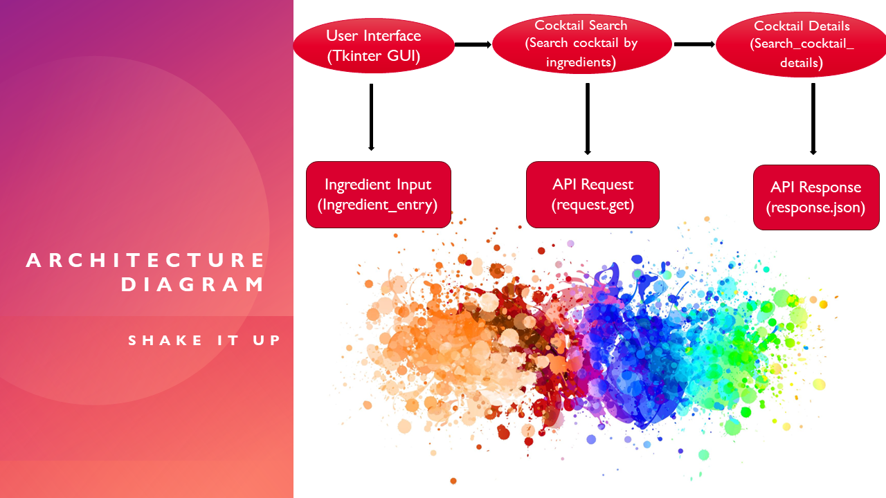
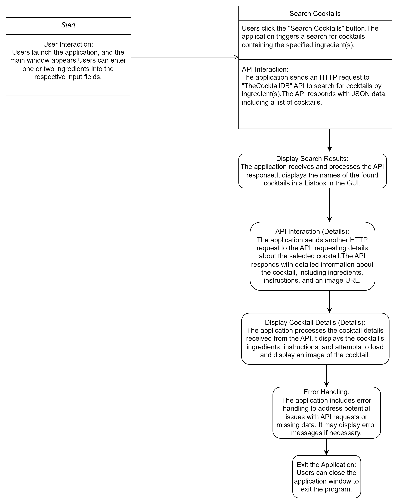

# 🍹 Cocktail Search App

A Python desktop application that allows users to search for cocktails by ingredients using the CocktailDB REST API.

## 📸 Screenshots




## ✨ Features

- Search cocktails by 1 or 2 ingredients simultaneously
- View detailed cocktail information (ingredients, measures, instructions)
- Display cocktail images fetched from the API
- Filter results by combining multiple ingredients

## 🛠️ Technologies Used

- **Python 3.x**
- **Tkinter** — GUI framework
- **Requests** — HTTP API calls
- **PIL/Pillow** — Image processing
- **Poetry** — Dependency management
- **CocktailDB REST API** — Data source

## 📂 Project Structure

CocktailProject_Python/
├── src/
│ └── cocktail_app/
│ ├── main.py # Main application & GUI
│ ├── cocktail_api.py # API interaction layer
│ └── init.py
├── tests/ # Test folder
├── docs/ # Architecture & flow diagrams
├── README.md
└── pyproject.toml


## 🚀 How to Run

### Using Poetry
```bash
# Install dependencies
poetry install

# Run the application
poetry run cocktail-app
```

### Using Python directly
```bash
# Install dependencies
pip install requests pillow

# Run the application
python -m src.cocktail_app.main
```

## 🏗️ Architecture

The application is built around two main classes:

**CocktailAPI** — handles all interactions with the CocktailDB API:
- Search cocktails by ingredient
- Fetch detailed cocktail information

**CocktailApp** — manages the GUI and application flow:
- Tkinter-based interface
- Search and display logic
- Image loading and rendering

## 👤 Author

[MiaB77](https://github.com/MiaB77)
